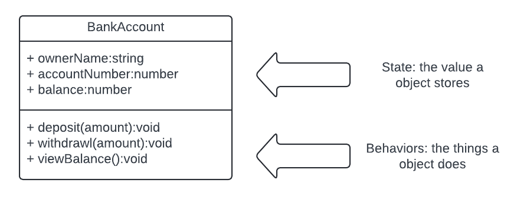

# Defining Classes

[Video](https://vimeo.com/932604764/693bd3cb80?share=copy)



### Background on OOP Concepts

**Object-Oriented Programming (OOP)** is a paradigm that models real-world entities as objects containing data (properties) and operations (methods).

**Classes** serve as blueprints for objects, detailing the properties and methods the objects will have.

**Constructors** are special methods within a class, responsible for initializing new objects.

**State** represents the data held by an object's properties, unique to each instance.

**Behavior** encompasses the methods an object can execute, often manipulating its state.

### Step-by-Step Guide with Code Examples

#### 1. Understanding the Object Structure
Objects are composed of an ID (unique memory location), state (data), and behavior (methods). This demo will focus on the latter two.

#### 2. Creating the BankAccount Class
Start by defining the `BankAccount` class and its constructor:

```javascript
class BankAccount {
  constructor(ownerName, accountNumber, balance) {
    this.ownerName = ownerName;
    this.accountNumber = accountNumber;
    this.balance = balance;
  }
}
```
The constructor sets up the properties using `this`, binding the provided values to each new object instance.

#### 3. Adding Methods to the Class
- **Deposit Method**:
```javascript
deposit(amount) {
  if (amount > 0) {
    this.balance += amount;
    console.log(`$${amount} deposited. New balance: $${this.balance}.`);
  } else {
    console.log('Deposit amount must be positive.');
  }
}
```
- **Withdrawal Method** (note: correct the spelling from `withdrawl` to `withdraw`):

```javascript
withdraw(amount) {
  if (amount <= this.balance) {
    this.balance -= amount;
    console.log(`$${amount} withdrawn. New balance: $${this.balance}.`);
  } else {
    console.log('Insufficient funds.');
  }
}
```
- **View Balance Method**:

```javascript
viewBalance() {
  console.log(`Current balance: $${this.balance}.`);
}
```

#### 5. Creating and Using BankAccount Objects
Instantiate `BankAccount` objects for Roger and Tom:

```javascript
const rogersAccount = new BankAccount('Roger', 123456, 1000);
const tomsAccount = new BankAccount('Tom', 654321, 500);
```
Perform operations like withdrawals and deposits:

```javascript
rogersAccount.withdraw(100); // Corrected from 'withdrawl' to 'withdraw'
tomsAccount.deposit(100);
```
Check balances:

```javascript
rogersAccount.viewBalance(); // Should log: "Current balance: $900."
tomsAccount.viewBalance();   // Should log: "Current balance: $600."
```

#### 6. Running the Code
To execute, save the script as `bankAccount.js` and run `node bankAccount.js` in your terminal if using Node.js.

### Key Concepts Illustrated

- **Independence of Objects**: Roger's and Tom's accounts operate independently, with distinct states that are manipulated through their methods.
- **Role of `this`**: The `this` keyword is essential for referring to and manipulating an object's properties within its methods.
- **Object Initialization**: Constructors ensure objects are initialized with essential properties, setting the stage for further operations.
