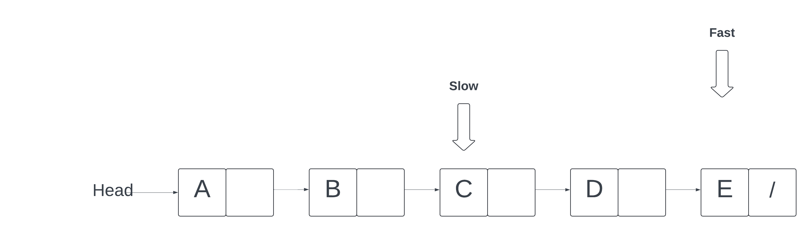

# Linked List 01
[video](https://vimeo.com/932557003/56d2cb10db?share=copy)


In today's lesson, we'll delve into the intricacies of linked lists, focusing particularly on the task of removing a node based on its value. As we navigate through the structure of linked lists, where each node is linked to the next without numerical indices, we'll explore the essential techniques for traversing these lists to locate and efficiently remove the desired node. This lesson will equip you with the skills to handle various edge cases, such as empty lists or the target node being at the head, ensuring the list remains intact and functional post-deletion. Join us as we unravel the nuances of this fundamental data structure operation, enhancing your understanding and proficiency in manipulating linked lists.

### Understanding Linked Lists

1. **Introduction to Linked Lists**: Explain that a linked list is a data structure consisting of nodes, where each node contains data and a reference (or link) to the next node in the sequence. Unlike arrays, linked lists do not have numerical indices.

2. **Traversal**: Discuss how to traverse a linked list starting from the head (the first node) and moving through each node by following the links until reaching the end, identified by a null reference in the next pointer of the last node.

### Setting Up the Linked List

3. **Creating a Linked List**: Start by initializing a new linked list and inserting nodes with values 'A', 'B', 'C', and 'D'. This sets up the example linked list for the operation to be demonstrated.

   ```javascript
   const list = new LinkedList();
   list.insert('A');
   list.insert('B');
   list.insert('C');
   list.insert('D');
   ```

4. **Displaying the Original List**: Print out the contents of the linked list to show the initial state before any deletion operation.

   ```javascript
   console.log("Original List: " + list.toString());
   ```

### Deleting a Node from the Linked List

5. **Defining the Deletion Function**: Create a function named `deleteNodeByValue` that takes a linked list and a value as arguments. This function will search for a node containing the given value and remove it from the list.

   ```javascript
   const deleteNodeByValue = (list, value) => {
       // Function body will be implemented in the following steps
   }
   ```

6. **Handling Edge Cases**: Add checks to handle edge cases, such as an empty list (where the head is null) or when the head itself contains the value to be deleted.

   ```javascript
   if(!list.head) return list;
   if(list.head.value === value){
       list.head = list.head.next;
       return list;
   }
   ```

7. **Traversing the List**: Set up a loop to traverse the list starting from the head. Use a variable like `current` to keep track of the current node being inspected.

   ```javascript
   let current = list.head;
   while(current.next){
       // Traversal logic will be implemented in the next step
   }
   ```

8. **Finding and Deleting the Target Node**: Within the loop, check if the `next` node's value matches the value to be deleted. If it does, adjust the current node's `next` pointer to skip over the found node, effectively removing it from the list.

   ```javascript
   if(current.next.value === value){
       current.next = current.next.next;
       return list;
   }
   current = current.next;
   ```

9. **Completing the Deletion Function**: Finalize the function by ensuring it returns the modified list after the deletion operation is completed.

### Testing the Deletion Function

10. **Invoking the Deletion Function**: Call the `deleteNodeByValue` function, passing the linked list and the value 'C' to be deleted.

    ```javascript
    const updatedList = deleteNodeByValue(list, 'C');
    ```

11. **Displaying the Updated List**: Print out the updated list to show the result of the deletion operation.

    ```javascript
    console.log("Updated List: " + updatedList.toString());
    ```


# Linked List 02

[video](https://vimeo.com/932576036/0b331b28d1?share=copy)
## Step 1


## Step 2


## Step 3


This guide will walk you through finding the middle node of a linked list, a common problem in computer science that can't be solved through simple indexing like with arrays. We'll use the "slow and fast pointers" approach for an efficient solution.

### Step 1: Understanding the Concept

Linked lists are linear data structures where each element (node) points to the next. Unlike arrays, they don't provide direct access to their middle element through indexing. To find the middle, we'll use two pointers at different speeds: a slow pointer moving one node at a time, and a fast pointer moving two nodes at a time.

### Step 2: Setting Up the Linked List

First, let's create a linked list and populate it with nodes:

```javascript
const LinkedList = require("./lib/linkedList");

const list = new LinkedList();
list.insert('A');
list.insert('B');
list.insert('C');
list.insert('D');
list.insert('E');
```

### Step 3: Implementing the Slow and Fast Pointers

Now, we'll write a function to find the middle node using the slow and fast pointers approach:

```javascript
const findMiddleNode = (list) => {
    // Check if the list is empty
    if(!list.head) return null;

    // Initialize slow and fast pointers at the head
    let slow = list.head;
    let fast = list.head;

    // Traverse the list
    while(fast && fast.next){
        slow = slow.next;       // Move slow pointer by one node
        fast = fast.next.next;  // Move fast pointer by two nodes
    }

    // When fast pointer reaches the end, slow pointer will be at the middle
    return slow.value;
}
```

### Step 4: Running the Function

Let's find the middle node of our linked list:

```javascript
const middleNode = findMiddleNode(list);
console.log("Middle Node: " + middleNode); // Expected output: C
```

### How It Works

1. Both slow and fast pointers start at the head of the list.
2. As you loop through the list, move the slow pointer one node forward (`slow = slow.next`) and the fast pointer two nodes forward (`fast = fast.next.next`).
3. If the fast pointer reaches the end of the list (`fast.next` is `null`), the slow pointer will be at the middle node.

### Conclusion

This technique efficiently finds the middle node in a single pass through the list, with a time complexity of O(n) and space complexity of O(1), making it ideal for large lists or when minimal memory usage is required.